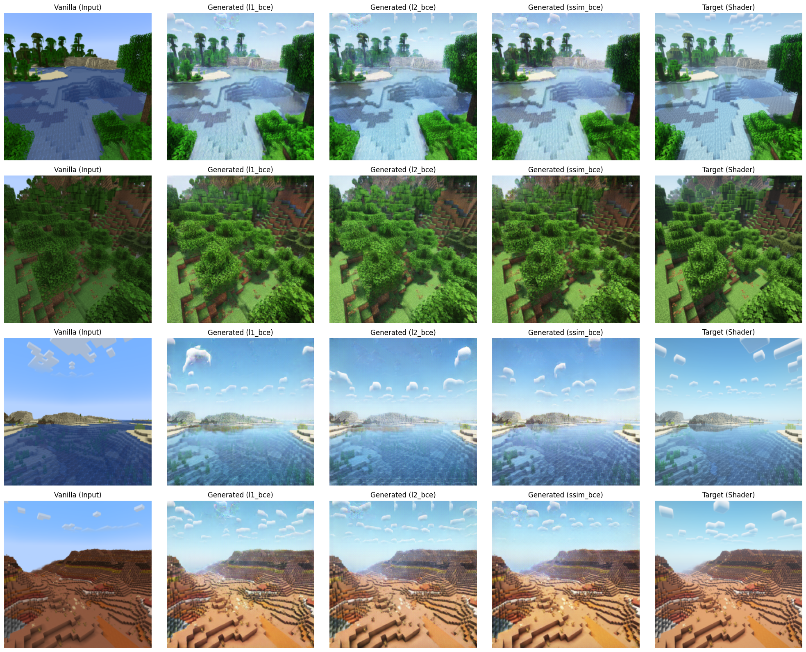

# Minecraft Shader GAN

This project has the goal of transforming a Minecraft vanilla picture into a picture with shaders on it.

Shaders were a popularized mod in the Minecraft community that allows to add GLSL shaders in the rendering pipeline, making it possible to create effects like improved lightning, shadow-casting, SSR in water, etc.

The completed work is documented in  notebook `notebook.ipynb` and some code in the `src` folder. The notebook lacks detailed comments but the code structure and functionality should be self-explanatory.

## Creating the dataset

### Taking the pictures

The dataset was created by myself using a script in `generator_bot` that uses `pyautogui` to hook to the Minecraft window and take screenshots of the game.

The script runs in a loop doing the following:
- Press `T` to open the chat and type `/rtp <range>` to teleport to a random location
- Wait a few seconds until the world is loaded
- Take a screenshot using `pyautogui` and save it in `screenshots/before/before_<id>.png`.
- Press `K` to turn the shaders on
- Wait a few seconds until the shaders are loaded
- Take a screenshot using `pyautogui` and save it in `screenshots/after/after_<id>.png`.

The script is run in a loop until the user stops it.
The `id` is a counter that is incremented at each iteration and is the same for both the before and after screenshots, allowing to make pairs of images further down the line. The `range` is the range of the random teleportation.

### RTP Plugin

The command `/rtp <range>` does not exist in the vanilla game, so I had to create a plugin (a server modification) which can be found in `generator_plugin` that teleports the player to a random location in the world. This is set to the highest block in the world and then summed a random offset. The yaw and pitch are also randomized. The pitch is limited to a range of -10 to 40 degrees to avoid the player looking to unnatural angles.

The command also checks if the random location is in the ocean biome, and if so, it teleports the player to a new location. This is done to avoid that the dataset is contaminated by ocean pictures which unfortunately the world seed generates.

### The world

The screenshots were taken in Minecraft 1.21.5 with default graphics settings with 12 chunks of render distance. The world seed is set to `"vcpi"` with the gamerules `"doDaylightCycle: false"` and `"doWeatherCycle: false"`, which make the sun position fixed and the weather static (not start raining unexpectedly). The time of day is set to 6000 ticks, which is the middle of the day (when the sun is at its highest).

The used shader was [Complementary Reimagined](https://github.com/ComplementaryDevelopment/ComplementaryReimagined), the most popular shader according to [Modrinth](https://modrinth.com/shader/complementary-reimagined) in the default `High` graphics settings.

To accelerate the screenshot process, the world is pregenerated using the [Chunky](https://modrinth.com/plugin/chunky) plugin, which pregenerates world chunks within a specified radius. This significantly improved world loading times and thus the overall screenshot collection speed.

To finish, the dataset was generated with 3600 pairs of images, totaling 7200 images.

## Training the model

The model was trained using Pix2Pix, which is the obvious choice for this task as we have nearly perfect pixel-to-pixel mapping between the before and after pictures.

The dataset was split into 90% for training and 10% for testing.

### Chosen loss functions

The training process experimented with multiple loss function configurations to determine the most effective approach for the Minecraft shader transformation task. As typical in Pix2Pix implementations, each configuration combines a pixel-wise reconstruction loss with an adversarial loss from the discriminator.

The following loss function combinations were tested:

#### Pixel-wise reconstruction losses:
- **L1 Loss**: Mean Absolute Error between generated and target images, promoting sharp reconstructions
- **L2 Loss**: Mean Squared Error between generated and target images, implemented using PyTorch's MSELoss
- **SSIM Loss**: Based on Structural Similarity Index Measure, focusing on perceptual similarity rather than pixel-wise differences.

#### Adversarial loss:
- **Binary Cross-Entropy (BCE)**: Used consistently across all configurations for the discriminator's adversarial loss, helping the generator produce more realistic shader effects

Each configuration was trained separately and their results were compared to determine which loss combination produced the most visually appealing and accurate shader transformations.

These configurations were trained for 300 epochs.

## Results

The following figure shows the final results of the model after training 300 epochs with different loss function configurations using images from the test set:

As we can see, all the configurations are able to generate very good results, generalizing water reflections, ambient lighting, fog and shadow casting. The `l2_bce` configuration seems to have generalized the shadows under the trees the best.

More results can be generated in the `notebook.ipynb` file.

## Future work and improvements

One limitation of this model is cloud generation. The shader pack uses custom cloud positioning and rendering that differs significantly from vanilla Minecraft's cloud system. This mismatch causes Pix2Pix to struggle with the pixel-to-pixel mapping in sky regions, resulting in visual artifacts. 

This issue could be addressed by either using a shader pack that maintains vanilla cloud positioning, or by exploring alternative training approaches that can better handle non-aligned features between input and target images.

Another area for improvement is day-light variation. The dataset only contains images captured during midday, limiting the model's ability to generate images for different times of day. Future iterations of this project could benefit from collecting a more temporally diverse dataset that includes sunrise, sunset, and nighttime scenarios. This would allow the model to learn how shader lighting, shadows, and atmospheric effects change throughout the day-night cycle, potentially enabling it to generalize across different lighting conditions.

An additional limitation of the dataset involves temporal inconsistencies between the paired images. Animals can move between the "before" and "after" screenshots, creating misaligned pixels that pose significant challenges for Pix2Pix's pixel-to-pixel mapping approach. Additionally, animated elements such as the water texture and leaves can change between captures, introducing further inconsistencies that degrade training quality.

This issue could potentially be resolved using Minecraft's `/tick freeze` command, which pauses all updates at a specific game tick. However, at the time of this project, this command has a memory leak that prevents chunk unloading when players move away from generated areas. This resulted in unsustainable memory usage after capturing only a few dozen image pairs, making it impractical for generating the large-scale dataset.

Also, the similarity of the results of the different loss functions made me wonder if they are implemented correctly. If I had more time, I would have liked to investigate this further.

Looking at how the model evolved across different epochs (last cell of the notebook), it's clear that it was already generating pretty good results after just a few epochs. This makes training for 300 epochs seem like way more than necessary.

To finish, the results could be evaluated using a more complex metric, for example the FID score or the LPIPS score, instead of only looking at the visual results.